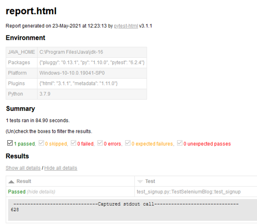
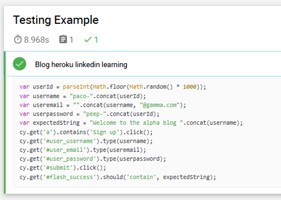

There are several tools to test and automate interactions with the browser. Selenium is probably the best known. Selenium had its debut in 2004, but since then a number of similar testing tools have appeared as alternatives. Some examples are: Puppeteer, Playwright, Nightwatch and Cypress. In this entry I will compare the use of Cypress and Playwright to test a user's sign up to a Web app.

## Testing user's signup with Selenium and Pytest

The code I use here was adapted from the Linkedin Learning course "Learning Selenium" by Meaghan Lewis where she tests a Web app hosted on Heroku. For Selenium I used the Python bindings, pytest and pytest-html to generate a report. I created a python virtual environment and installed the required packages:

```
pip install selenium pytest pytest-html
```

This is the code used with Selenium-Python to run in headless mode:

```
# file name: test_signup.py
import uuid
import pytest
from selenium import webdriver
from selenium.webdriver.common.keys import Keys
from selenium.webdriver.firefox.options import Options

class TestSeleniumBlog():

    def setup_method(self):
        options = Options()
        options.headless = True
        self.driver = webdriver.Firefox(options=options)

    def test_signup(self):
        # Create a unique user for each signup
        userid = str(uuid.uuid1())[:3]
        username = f'paul{userid}'
        self.driver.get('https://selenium-blog.herokuapp.com')
        signup_link = self.driver.find_element_by_link_text('Sign up')
        signup_link.click()

        username_field = self.driver.find_element_by_id("user_username")
        username_field.send_keys(username)

        email_field = self.driver.find_element_by_id("user_email")
        email_field.send_keys(f'{username}@gmail.com')

        password_field = self.driver.find_element_by_id("user_password")
        password_field.send_keys(str(uuid.uuid1()))

        submit_button = self.driver.find_element_by_id("submit")
        submit_button.click()
    
        flash_heading = self.driver.find_element_by_id('flash_success')
        assert flash_heading.text == f'Welcome to the alpha blog {username}'
        
    def teardown_method(self):
        self.driver.close()
```

The code is executed with the command:

```
pytest test_signup.py --html=report.html --self-contained-html
```

An HTML report (report.html) is generated:



## Testing user's signup with Cypress

The code used with cypress looks more straightforward and compact than the one using Selenium. Actually, the code runs faster than the code for Selenium-Pytest.

```
const URL = 'https://selenium-blog.herokuapp.com';

describe('Signup Testing Example', () => {
    it('Sign up at heroku app', () => {
        // Create a unique user for each signup
        let userId = parseInt(Math.floor(Math.random() * 1000));
        let username = `paul${userId}`;
        let useremail = `${username}@gamma.com`;
        let userpassword = `peep-${userId}`;
        let expectedString = `Welcome to the alpha blog ${username}`;
        cy.visit(URL);
        cy.get('a').contains('Sign up').click();
        cy.get('#user_username').type(username);
        cy.get('#user_email').type(useremail);
        cy.get('#user_password').type(userpassword);
        cy.get('#submit').click();
        cy.get('#flash_success').should('contain', expectedString);
    })
})
```

Then we have to run the script in headless mode:

```
npx cypress run
```

If we use the mochawesome report generator, we obtain:

