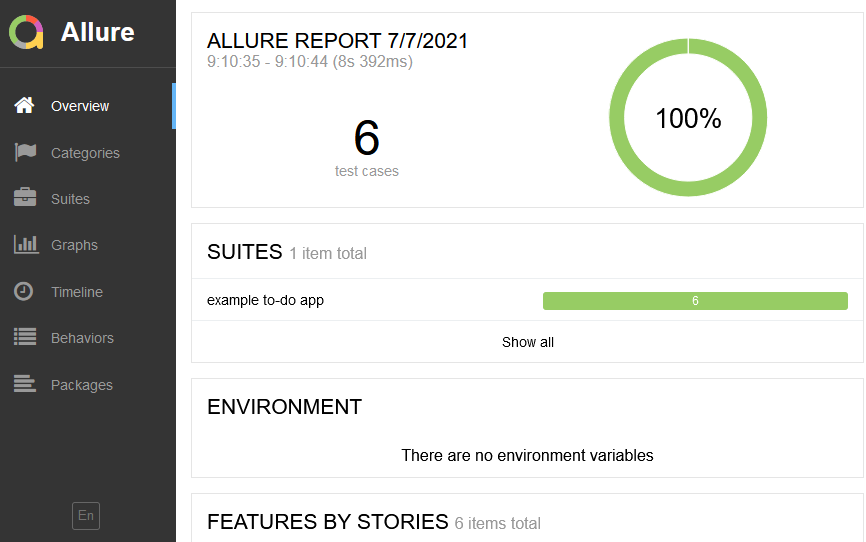
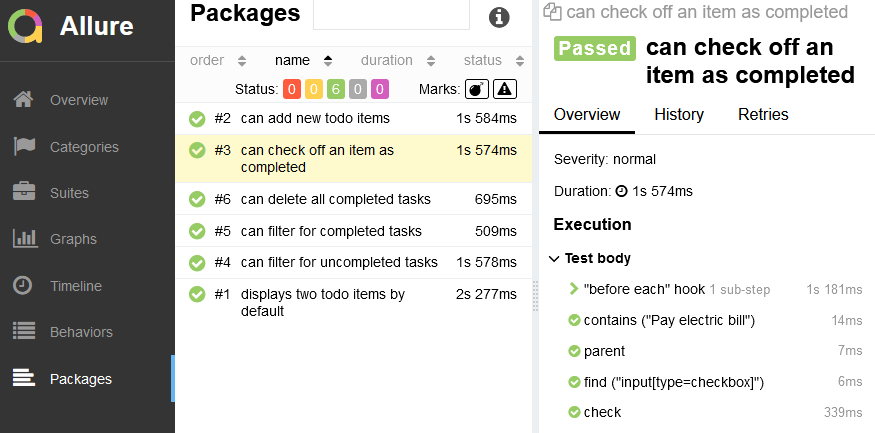

Allure is a test tool to create nice-looking and concise reports. It can be configured to show bugs, fixtures, broken tests, timing, and history.

In order to use it with cypress we must install the cypress allure plugin and allure command-line packages.


npm i -D @shelex/cypress-allure-plugin allure-commandline


Then we add the next lines of code to the file **cypress/plugins/index.js**

```
/// <reference types="@shelex/cypress-allure-plugin" />
const allureWriter = require('@shelex/cypress-allure-plugin/writer');
// import * as allureWriter from "@shelex/cypress-allure-plugin/writer";

module.exports = (on, config) => {
    allureWriter(on, config);
    return config;
};
```

Then we modify **cypress/support/index.js** as well by adding:

```
import '@shelex/cypress-allure-plugin';
```

After that we can start executing the test suite:

```
cypress run --env allure=true

allure generate allure-results --clean -o allure-report
```

Two folders are going to be created: **allure-results** with the results in json format, and **allure-results** which contains the HTML report with the necessary assets.

As an example, we show the results for the next test taken from the cypress examples:

```
/// <reference types="cypress" />

describe('example to-do app', () => {
  beforeEach(() => {
    cy.visit('https://example.cypress.io/todo')
  })

  it('displays two todo items by default', () => {
    cy.get('.todo-list li').should('have.length', 2)

    cy.get('.todo-list li').first().should('have.text', 'Pay electric bill')
    cy.get('.todo-list li').last().should('have.text', 'Walk the dog')
  })

  it('can add new todo items', () => {
    cy.get('[data-test=new-todo]').type(`${newItem}{enter}`)

    cy.get('.todo-list li')
      .should('have.length', 3)
      .last()
      .should('have.text', newItem)
  })

  it('can check off an item as completed', () => {
    cy.contains('Pay electric bill')
      .parent()
      .find('input[type=checkbox]')
      .check()

    cy.contains('Pay electric bill')
      .parents('li')
      .should('have.class', 'completed')
  })

  context('with a checked task', () => {
    beforeEach(() => {
      cy.contains('Pay electric bill')
        .parent()
        .find('input[type=checkbox]')
        .check()
    })

    it('can filter for uncompleted tasks', () => {
      cy.contains('Active').click()

      cy.get('.todo-list li')
        .should('have.length', 1)
        .first()
        .should('have.text', 'Walk the dog')

      cy.contains('Pay electric bill').should('not.exist')
    })

    it('can filter for completed tasks', () => {
      cy.contains('Completed').click()

      cy.get('.todo-list li')
        .should('have.length', 1)
        .first()
        .should('have.text', 'Pay electric bill')

      cy.contains('Walk the dog').should('not.exist')
    })

    it('can delete all completed tasks', () => {
      cy.contains('Clear completed').click()

      cy.get('.todo-list li')
        .should('have.length', 1)
        .should('not.have.text', 'Pay electric bill')

      cy.contains('Clear completed').should('not.exist')
    })
  })
})
```

These screenshots show some sections of the allure report:



